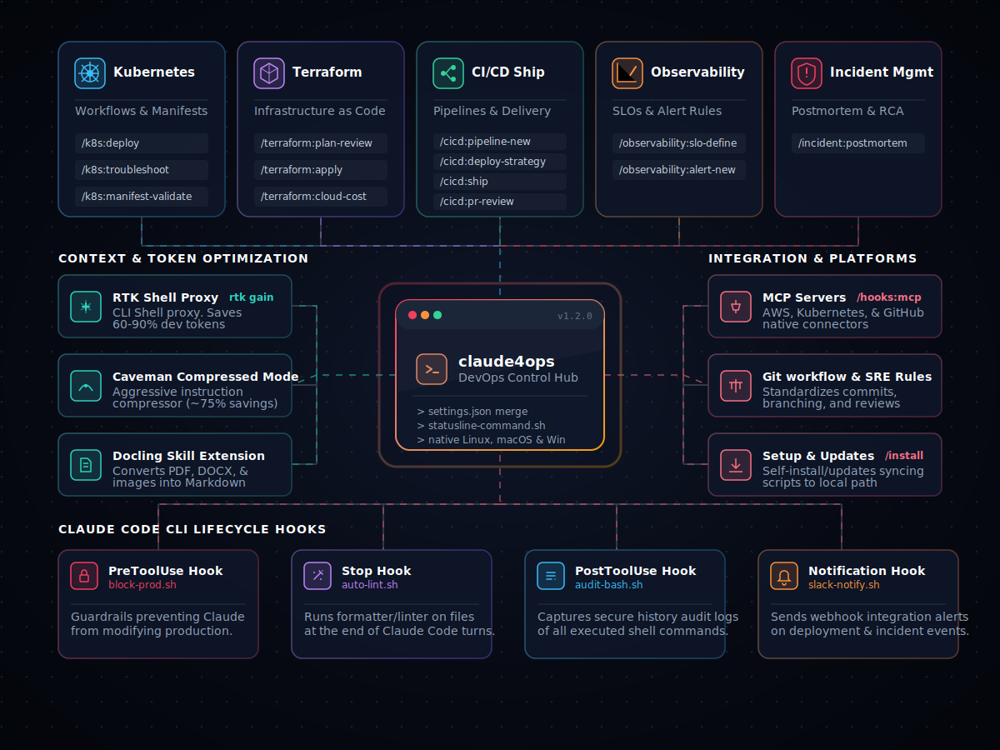

# claude4ops — DevOps Superpowers for Everyone


[](./LICENSE)
[](https://github.com/ops4life/claude4ops)
[](https://github.com/ops4life/claude4ops)
[](https://github.com/ops4life/claude4ops)
[](https://github.com/ops4life/claude4ops)

Production-ready DevOps superpowers for everyone. Guided workflows for Kubernetes, Terraform, CI/CD, SLOs, and incident response — with token optimization built in. Runs on Linux, macOS, and Windows.

## Why claude4ops?

DevOps workflows are repetitive, error-prone, and hard to get right. claude4ops brings structured, production-tested procedures directly into Claude Code so you skip the RTFM loop and ship safely:

- **Kubernetes** — deploy, validate manifests, and debug pods without memorizing kubectl flags
- **Terraform** — review plans for risk and cost impact before `apply`, with state backup and rollback
- **CI/CD** — generate GitHub Actions / GitLab pipelines, design blue/green or canary strategies, ship features end-to-end
- **Observability** — define SLOs with error budgets, create SLO-based alerts with burn-rate thresholds and runbook links
- **Incident response** — run blameless postmortems with structured timelines, RCA, and action items
- **Multi-cloud** — all commands cover AWS, GCP, and Azure with provider-specific examples
- **Multi-platform** — native support for Linux, macOS, and Windows (PowerShell, WSL2, or Git Bash)

## Installation

### Quick Install (Recommended)

```
/plugin marketplace add ops4life/claude4ops
/plugin install claude4ops
```

### From Local Source

```bash
git clone https://github.com/ops4life/claude4ops.git
# In Claude Code:
# /plugin marketplace add /absolute/path/to/claude4ops
# /plugin install claude4ops
```

### Setup

After installing the plugin, run `/claude4ops:install` to configure Claude Code:

- **Scope**: user (`~/.claude/`) or project (`.claude/`)
- **Settings**: `settings.json` merge + status line script
- **Hooks**: block-prod, auto-lint, audit, Slack notifications
- **MCP servers**: AWS, Kubernetes, GitHub
- **Skills**: docling (PDF/DOCX/image → Markdown)
- **Rules**: git workflow standards
- **Optimization**: token-efficient tools — RTK shell proxy (60-90% savings) + Caveman compressed mode (~75% savings)
- **Plugins**: context7, playwright, superpowers, frontend-design

### Architecture & Components



### Platform Support

| Platform | Shell | Hook scripts |
|----------|-------|--------------|
| Linux | bash / sh | `.sh` |
| macOS | bash / sh | `.sh` |
| Windows | PowerShell (pwsh) | `.ps1` — invoked via `pwsh -NoProfile -File` |
| Windows | WSL2 or Git Bash | `.sh` |

**Prerequisites**: [`jq`](https://jqlang.org) — `apt-get install jq` · `brew install jq` · `winget install stedolan.jq`. Optional on Windows PowerShell (falls back to built-in JSON).

**Windows one-time setup**: allow script execution before running `/claude4ops:install`:
```powershell
Set-ExecutionPolicy -Scope CurrentUser RemoteSigned
```

## Commands

All commands: `/claude4ops:<category>:<command>`

### Kubernetes

| Command | Description |
|---------|-------------|
| `/claude4ops:k8s:deploy` | Guided deployment with pre/post validation and rollback |
| `/claude4ops:k8s:troubleshoot` | Systematic debugging for pods, services, and network issues |
| `/claude4ops:k8s:manifest-validate` | YAML validation for syntax, security, and best practices |

### Terraform

| Command | Description |
|---------|-------------|
| `/claude4ops:terraform:plan-review` | Risk, security, and cost analysis of a Terraform plan |
| `/claude4ops:terraform:apply` | Safe apply with state backup and rollback procedures |
| `/claude4ops:terraform:cloud-cost` | Multi-cloud cost analysis and right-sizing recommendations |

### CI/CD

| Command | Description |
|---------|-------------|
| `/claude4ops:cicd:pipeline-new` | Generate production CI/CD pipeline (GitHub Actions, GitLab, Jenkins) |
| `/claude4ops:cicd:ship` | Full agentic pipeline: lint → test → confirm → commit → push |
| `/claude4ops:cicd:pr-review` | DevOps-focused review: Terraform, secrets, containers, pipelines |
| `/claude4ops:cicd:deploy-strategy` | Design blue/green, canary, or rolling deployment strategy |

### Observability

| Command | Description |
|---------|-------------|
| `/claude4ops:observability:slo-define` | Define SLOs/SLIs with error budgets and burn-rate alerting |
| `/claude4ops:observability:alert-new` | Create SLO-based monitoring alerts with runbook links |

### Install & Automation

| Command | Description |
|---------|-------------|
| `/claude4ops:install` | Install hooks, skills, rules, settings, plugins, and token optimization tools — user or project scope |
| `/claude4ops:hooks:mcp-setup` | Configure MCP servers for AWS, Kubernetes, and GitHub |

### Incident Management

| Command | Description |
|---------|-------------|
| `/claude4ops:incident:postmortem` | Blameless postmortem with timeline, RCA, and action items |

## Common Workflows

**Deploy to Kubernetes:**
```
/claude4ops:k8s:manifest-validate → /claude4ops:k8s:deploy → /claude4ops:k8s:troubleshoot
```

**Infrastructure change:**
```
/claude4ops:terraform:plan-review → /claude4ops:terraform:apply → /claude4ops:terraform:cloud-cost
```

**Feature ship:**
```
/claude4ops:cicd:pr-review main → work on feature → /claude4ops:cicd:ship feat(api): add rate limiting
```

**First-time setup (do once):**
```
/claude4ops:install  # select All to install everything, or pick components individually
/claude4ops:hooks:mcp-setup
```

## Contributing

See [CONTRIBUTING.md](./CONTRIBUTING.md) for the full guide: setup, command structure, worked example, commit format, and PR process.

## Resources

- [CONTRIBUTING.md](./CONTRIBUTING.md) — contributor guide
- [CLAUDE.md](./CLAUDE.md) — plugin architecture
- [.github/RELEASING.md](./.github/RELEASING.md) — release process
- [Edmund's Claude Code](https://github.com/edmund-io/edmunds-claude-code) — reference implementation

## License

MIT — see [LICENSE](./LICENSE)
